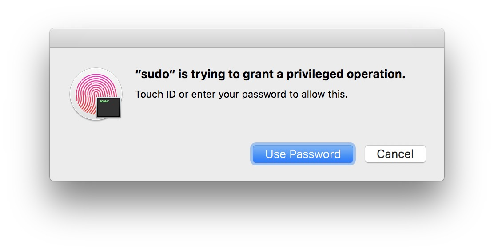

# sudo-touchid
`sudo-touchid` is a fork of `sudo` with Touch ID support on macOS (powered by the `LocalAuthentication` framework). Once compiled, it will allow you to authenticate `sudo` commands with Touch ID in the Terminal on supported Macs (such as the late 2016 MacBook Pros).

## Screenshot

## Warning

Only tested under the MacBook Pro with Touch Bar, macOS 10.12.1.

## Building

To build `sudo-touchid`, simply open the included Xcode project file with Xcode 8+, select the `Build All` target, and click **Build**.

## Running

If we try running our newly-built `sudo` executable now, we'll get an error:

> sudo must be owned by uid 0 and have the setuid bit set

To fix this, we can use our system's `sudo` command and the `chown/chmod` commands to give our newly-built `sudo` the permissions it needs:

> cd (built-products-directory)

> sudo chown root:wheel sudo && sudo chmod 4755 sudo

Now if we try running our copy of `sudo`, it should work:

> cd (built-products-directory)

> ./sudo -s

## Installing

Replacing the system's `sudo` program is quite risky (can prevent your Mac from booting) and requires disabling System Integrity Protection (aka "Rootless").

Instead of replacing `sudo`, we can install our build under `/usr/local/bin` and give the path precedence over `/usr/bin`, this way our build is found first.

> sudo cp (built-products-directory)/sudo /usr/local/bin/sudo

> sudo chown root:wheel /usr/local/bin/sudo && sudo chmod 4755 /usr/local/bin/sudo

You can set up your `PATH` by adding `export PATH=/usr/local/bin:$PATH` to `.bashrc` (thanks @edenzik).

Now you should be able to enter `sudo` in any Terminal (or iTerm) window and authenticate with Touch ID!
